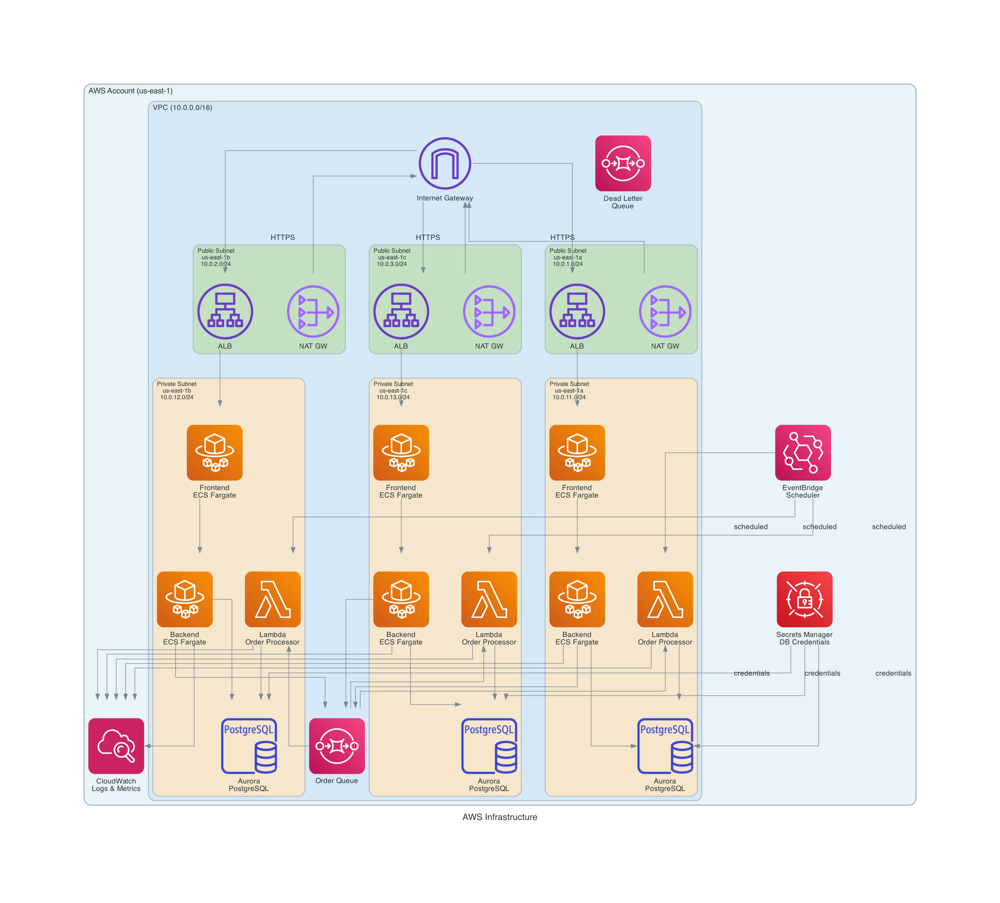
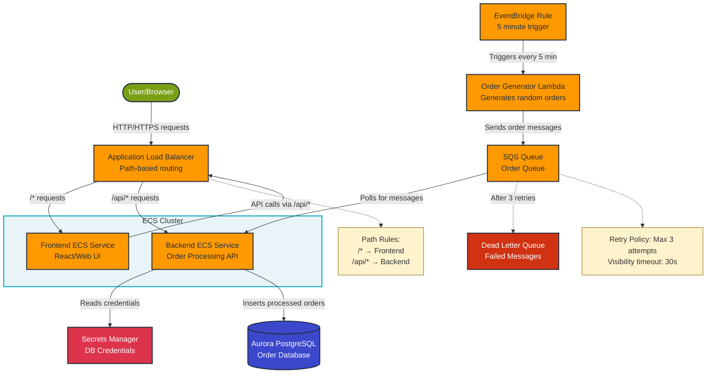

# Order Processing Infrastructure

Enterprise-grade, production-ready AWS order processing system built with Infrastructure as Code. This project demonstrates modern cloud architecture, DevOps best practices, and complete observability for real-time order processing at scale.

## Table of Contents

- [Live Test Deployment](#live-test-deployment)
- [Architecture Overview](#architecture-overview)
- [Key Features](#key-features)
- [Quick Start](#quick-start)
- [Project Structure](#project-structure)
- [Testing](#testing)
- [Monitoring](#monitoring)
- [Database Migrations](#database-migrations)
- [CI/CD](#cicd)
- [Documentation](#documentation)
- [Cost Estimates](#cost-estimates)
- [Security](#security)
- [Troubleshooting](#troubleshooting)

## Live Test Deployment

### Deployed Environment

The infrastructure is currently deployed to AWS and fully operational:

**Environment:** Development (dev)
**Region:** us-east-1
**Application URL:** http://order-processing-alb-1266002485.us-east-1.elb.amazonaws.com

### Deployed Stacks

All infrastructure components are successfully deployed via CloudFormation:

1. **dev-NetworkStack** - VPC, Subnets, NAT Gateways, Security Groups
2. **dev-DatabaseStack** - Aurora Serverless v2 PostgreSQL
3. **dev-MessagingStack** - SQS Queues, Lambda Order Producer
4. **dev-ApplicationStack** - ECS Fargate Services, Application Load Balancer

### Get Stack Information

```bash
# Configure AWS credentials
export AWS_ACCESS_KEY_ID="your-access-key"
export AWS_SECRET_ACCESS_KEY="your-secret-key"
export AWS_DEFAULT_REGION="us-east-1"

# Get Application URL
aws cloudformation describe-stacks \
  --stack-name dev-ApplicationStack \
  --query 'Stacks[0].Outputs[?OutputKey==`LoadBalancerURL`].OutputValue' \
  --output text

# List all deployed stacks
aws cloudformation list-stacks \
  --stack-status-filter CREATE_COMPLETE UPDATE_COMPLETE \
  --query 'StackSummaries[?contains(StackName, `dev-`)].StackName' \
  --output table
```

### Live Features

- **Auto-Generated Orders**: Lambda function generates sample orders every 5 minutes
- **Real-Time Processing**: Orders are queued via SQS and processed by ECS workers
- **API Endpoints**: RESTful API for order management (`/api/orders`, `/api/health`)
- **Web Dashboard**: React frontend for order visualization
- **Complete Observability**: CloudWatch Logs, Metrics, and Alarms for all components

### Test the Deployment

```bash
# Health check
curl http://order-processing-alb-1266002485.us-east-1.elb.amazonaws.com/health

# Get orders
curl http://order-processing-alb-1266002485.us-east-1.elb.amazonaws.com/api/orders

# View the dashboard
open http://order-processing-alb-1266002485.us-east-1.elb.amazonaws.com
```

## Architecture Overview

This infrastructure implements a modern, cloud-native order processing system with the following components:

### High-Level Architecture



The architecture provides:

- **Multi-AZ VPC** spanning 3 Availability Zones with public/private subnets
- **Application Load Balancer** routing HTTP traffic to frontend and backend services
- **ECS Fargate Services** for containerized backend (Express API + SQS worker) and frontend (React SPA)
- **Aurora Serverless v2 PostgreSQL** with automatic capacity management and multi-AZ replication
- **SQS Queue System** for reliable order message processing with Dead Letter Queue
- **Lambda Order Producer** generating sample orders every 5 minutes via EventBridge
- **Complete CloudWatch Integration** for logs, metrics, and alarms

### Network Architecture

- **3 Availability Zones** for high availability
- **Public Subnets**: Internet Gateway, NAT Gateways, Application Load Balancer
- **Private Subnets**: ECS Tasks, Aurora Database, Lambda Functions
- **Security Groups**: Least-privilege network access control
- **VPC Flow Logs**: Network traffic monitoring and security analysis

### Data Flow

1. **Order Generation**: EventBridge triggers Lambda every 5 minutes to generate sample orders
2. **Message Queue**: Lambda sends orders to SQS queue
3. **Processing**: ECS worker consumes messages from SQS and processes orders
4. **Storage**: Processed orders stored in Aurora PostgreSQL database
5. **API Access**: Backend API provides RESTful endpoints for order retrieval
6. **User Interface**: React frontend displays orders in real-time dashboard

### Application Flow Diagram



### CI/CD Pipeline Flow

```mermaid
flowchart TB
    %% Styling
    classDef trigger fill:#7AA116,stroke:#232F3E,stroke-width:2px,color:#fff
    classDef build fill:#3B48CC,stroke:#232F3E,stroke-width:2px,color:#fff
    classDef security fill:#D13212,stroke:#232F3E,stroke-width:2px,color:#fff
    classDef deploy fill:#FF9900,stroke:#232F3E,stroke-width:2px,color:#232F3E
    classDef approval fill:#DD344C,stroke:#232F3E,stroke-width:2px,color:#fff
    classDef success fill:#1D8102,stroke:#232F3E,stroke-width:2px,color:#fff

    %% Source Control
    GitPush([Git Push]):::trigger
    BranchCheck{Branch?}:::trigger

    %% Build & Test Stage
    subgraph BuildTest[Build & Test Stage]
        Install[npm ci<br/>Install dependencies]:::build
        Lint[npm run lint<br/>Code quality checks]:::build
        UnitTests[npm run test<br/>Unit tests]:::build
        Coverage[Coverage Report<br/>Generate & validate]:::build
        CDKSynth[CDK Synth<br/>Generate CloudFormation]:::build
    end

    %% Security Scanning
    subgraph Security[Security Scanning]
        NPMAudit[NPM Audit<br/>Dependency vulnerabilities]:::security
        CDKNAG[CDK NAG<br/>Infrastructure security rules]:::security
    end

    %% Dev Deployment
    subgraph DevDeploy[Dev Environment Deploy - Auto]
        DevSequence[Sequential Stack Deployment]:::deploy
        DevNetwork[1. Network Stack<br/>VPC, Subnets, NAT]:::deploy
        DevDatabase[2. Database Stack<br/>Aurora PostgreSQL]:::deploy
        DevMessaging[3. Messaging Stack<br/>SQS, EventBridge, Lambda]:::deploy
        DevApplication[4. Application Stack<br/>ECS, ALB, Services]:::deploy
        DevMonitoring[5. Monitoring Stack<br/>CloudWatch, Alarms]:::deploy
    end

    %% Production Approval
    ManualApproval{Manual Approval<br/>Required}:::approval

    %% Prod Deployment
    subgraph ProdDeploy[Production Environment Deploy]
        ProdSequence[Sequential Stack Deployment]:::deploy
        ProdNetwork[1. Network Stack<br/>VPC, Subnets, NAT]:::deploy
        ProdDatabase[2. Database Stack<br/>Aurora PostgreSQL]:::deploy
        ProdMessaging[3. Messaging Stack<br/>SQS, EventBridge, Lambda]:::deploy
        ProdApplication[4. Application Stack<br/>ECS, ALB, Services]:::deploy
        ProdMonitoring[5. Monitoring Stack<br/>CloudWatch, Alarms]:::deploy
    end

    %% Completion
    Success([Deployment Complete]):::success
    Failed([Deployment Failed]):::security

    %% Flow - Source to Build
    GitPush --> BranchCheck
    BranchCheck -->|develop branch| BuildTest
    BranchCheck -->|main branch| BuildTest

    %% Build & Test Flow
    Install --> Lint
    Lint --> UnitTests
    UnitTests --> Coverage
    Coverage --> CDKSynth

    %% Security Scanning
    CDKSynth --> Security
    NPMAudit & CDKNAG --> SecurityGate{Security<br/>Pass?}:::security

    %% Branch-based Deployment
    SecurityGate -->|Pass + develop| DevDeploy
    SecurityGate -->|Pass + main| ManualApproval
    SecurityGate -->|Fail| Failed

    %% Dev Deployment Sequence
    DevSequence --> DevNetwork
    DevNetwork --> DevDatabase
    DevDatabase --> DevMessaging
    DevMessaging --> DevApplication
    DevApplication --> DevMonitoring
    DevMonitoring --> Success

    %% Prod Deployment Sequence
    ManualApproval -->|Approved| ProdDeploy
    ManualApproval -->|Rejected| Failed
    ProdSequence --> ProdNetwork
    ProdNetwork --> ProdDatabase
    ProdDatabase --> ProdMessaging
    ProdMessaging --> ProdApplication
    ProdApplication --> ProdMonitoring
    ProdMonitoring --> Success

    %% Notes
    note1[Auto-deploy on develop<br/>Manual approval on main]
    note2[Stacks deployed sequentially<br/>to ensure dependencies]

    BranchCheck -.-> note1
    DevSequence -.-> note2

    style note1 fill:#FFF3CD,stroke:#856404,stroke-width:1px
    style note2 fill:#FFF3CD,stroke:#856404,stroke-width:1px
    style BuildTest fill:#E8F4F8,stroke:#00A4BD,stroke-width:2px
    style Security fill:#FFE5E5,stroke:#D13212,stroke-width:2px
    style DevDeploy fill:#FFF3E0,stroke:#FF9900,stroke-width:2px
    style ProdDeploy fill:#FFF3E0,stroke:#FF9900,stroke-width:2px
```



## Key Features

### Infrastructure

- Multi-AZ high availability across 3 Availability Zones
- Auto-scaling ECS services based on CPU/Memory metrics
- Aurora Serverless v2 with automatic capacity management (0.5-1 ACU)
- Private subnet architecture (no public IPs for compute/database)
- IAM least privilege with scoped permissions
- Secrets Manager integration for credential management
- Infrastructure as Code using AWS CDK (TypeScript)
- CloudFormation-based deployment with automatic rollback

### Observability

- Comprehensive CloudWatch Logs for all services
- Custom metrics and dashboards
- Intelligent alerting with SNS notifications
- VPC Flow Logs for network security
- Application performance monitoring
- Database performance insights

### Security

- Network isolation with private subnets
- Security groups with deny-by-default policies
- IAM least privilege access control
- Secrets Manager for credential storage
- Encryption at rest (Aurora KMS, SQS SSE)
- Encryption in transit (TLS 1.2+)
- Automated security group management

### DevOps

- CI/CD ready with Azure DevOps pipeline configuration
- Automated testing (unit tests, integration tests, E2E tests)
- Blue-green deployment capability
- Automated rollback on failure
- Infrastructure drift detection
- Cost optimization strategies

## Quick Start

### Prerequisites

Before deploying, ensure you have:

- **Node.js** >= 20.x ([Download](https://nodejs.org/))
- **Docker** >= 24.x ([Download](https://www.docker.com/))
- **AWS CLI** >= 2.x ([Install Guide](https://docs.aws.amazon.com/cli/latest/userguide/getting-started-install.html))
- **AWS Account** with appropriate IAM permissions
- **Git** for version control

### Step 1: Clone Repository

```bash
git clone <repository-url>
cd order-processing-infrastructure
```

### Step 2: Install Dependencies

```bash
npm install
```

### Step 3: Configure AWS Credentials

```bash
# Option 1: Environment Variables
export AWS_ACCESS_KEY_ID="your-access-key"
export AWS_SECRET_ACCESS_KEY="your-secret-key"
export AWS_DEFAULT_REGION="us-east-1"

# Option 2: AWS CLI Configuration
aws configure
```

### Step 4: Bootstrap CDK (First Time Only)

```bash
# Bootstrap CDK for your AWS account and region
npx cdk bootstrap aws://<ACCOUNT-ID>/us-east-1
```

### Step 5: Build Docker Images

```bash
# Create ECR repositories (if not exist)
aws ecr create-repository --repository-name order-processor-backend
aws ecr create-repository --repository-name order-processor-frontend

# Authenticate Docker to ECR
aws ecr get-login-password --region us-east-1 | \
  docker login --username AWS --password-stdin <ACCOUNT-ID>.dkr.ecr.us-east-1.amazonaws.com

# Build and push backend
cd app/backend
docker build -t order-processor-backend:latest .
docker tag order-processor-backend:latest <ACCOUNT-ID>.dkr.ecr.us-east-1.amazonaws.com/order-processor-backend:latest
docker push <ACCOUNT-ID>.dkr.ecr.us-east-1.amazonaws.com/order-processor-backend:latest

# Build and push frontend
cd ../frontend
docker build -t order-processor-frontend:latest .
docker tag order-processor-frontend:latest <ACCOUNT-ID>.dkr.ecr.us-east-1.amazonaws.com/order-processor-frontend:latest
docker push <ACCOUNT-ID>.dkr.ecr.us-east-1.amazonaws.com/order-processor-frontend:latest
```

### Step 6: Deploy Infrastructure

```bash
# Return to infrastructure directory
cd ../../

# Set environment
export ENVIRONMENT=dev

# Deploy all stacks
npx cdk deploy --all --require-approval never
```

**Deployment Time:** Approximately 15-20 minutes

### Step 7: Verify Deployment

```bash
# Get application URL
aws cloudformation describe-stacks \
  --stack-name dev-ApplicationStack \
  --query 'Stacks[0].Outputs[?OutputKey==`LoadBalancerURL`].OutputValue' \
  --output text

# Test the application
./scripts/test-deployment.sh
```

## Project Structure

```
order-processing-infrastructure/
├── README.md                                    # This file
├── bin/
│   └── order-processing-infrastructure.ts       # CDK app entry point
├── lib/
│   ├── config/
│   │   └── environment-config.ts                # Environment configurations
│   └── stacks/
│       ├── network-stack.ts                     # VPC, Subnets, NAT Gateways
│       ├── database-stack.ts                    # Aurora Serverless v2
│       ├── messaging-stack.ts                   # SQS + Lambda Producer
│       ├── application-stack.ts                 # ECS + ALB
│       └── waf-stack.ts                         # AWS WAF configuration
├── app/
│   ├── backend/                                 # Express API + SQS Worker
│   │   ├── src/
│   │   │   ├── routes/                          # API route handlers
│   │   │   ├── models/                          # Data models
│   │   │   ├── api-server.ts                    # Express API server
│   │   │   ├── sqs-handler.ts                   # SQS message processor
│   │   │   ├── database.ts                      # Database connection
│   │   │   └── index.ts                         # Main entry point
│   │   ├── Dockerfile
│   │   └── package.json
│   └── frontend/                                # React Dashboard
│       ├── src/
│       │   ├── components/                      # React components
│       │   ├── services/                        # API service layer
│       │   ├── App.tsx                          # Main app component
│       │   └── main.tsx                         # Entry point
│       ├── Dockerfile
│       ├── nginx.conf                           # Nginx configuration
│       └── package.json
├── lambda/
│   └── order-producer/                          # Order Generation Lambda
│       ├── index.py                             # Lambda function code
│       └── requirements.txt                     # Python dependencies
├── test/
│   └── stacks/                                  # CDK unit tests
│       ├── network-stack.test.ts
│       ├── database-stack.test.ts
│       ├── messaging-stack.test.ts
│       └── application-stack.test.ts
├── diagrams/                                    # Architecture diagrams
│   ├── infrastructure-diagram.png               # Infrastructure overview
│   ├── application-flow.mmd                     # Application flow diagram
│   └── cicd-pipeline-flow.mmd                   # CI/CD pipeline flow
├── docs/
│   ├── cicd-strategy.md                         # Azure DevOps pipeline guide
│   ├── observability-security.md                # Monitoring & security
│   ├── unit-tests-summary.md                    # Comprehensive test documentation
│   ├── diagrams.md                              # Diagram documentation
│   └── quick-reference.md                       # Quick reference guide
├── scripts/
│   ├── diagrams/                                # Diagram generation scripts
│   └── test-deployment.sh                       # E2E test script
├── .github/
│   └── workflows/                               # GitHub Actions workflows
├── cdk.json                                     # CDK configuration
├── jest.config.js                               # Jest test configuration
├── package.json                                 # Node.js dependencies
└── tsconfig.json                                # TypeScript configuration
```

## Testing

### Unit Tests

The infrastructure includes comprehensive unit tests for all CDK stacks:

```bash
# Run all tests
npm test

# Run specific stack tests
npm test -- test/stacks/network-stack.test.ts
npm test -- test/stacks/database-stack.test.ts
npm test -- test/stacks/messaging-stack.test.ts

# Generate coverage report
npm test -- --coverage
```

**Test Results:**
- NetworkStack: 9/9 tests passing
- DatabaseStack: 12/12 tests passing
- MessagingStack: 13/13 tests passing
- ApplicationStack: 25/25 tests passing
- Total: 59 passing tests across all infrastructure stacks

See [docs/unit-tests-summary.md](./docs/unit-tests-summary.md) for detailed test documentation.

### End-to-End Testing

```bash
# Run deployment verification script
chmod +x scripts/test-deployment.sh
./scripts/test-deployment.sh
```

This script validates:
- ALB health check endpoint
- Backend API endpoints
- Order creation and retrieval
- SQS message processing
- Database connectivity

### Manual API Testing

```bash
# Get ALB DNS
ALB_DNS=$(aws cloudformation describe-stacks \
  --stack-name dev-ApplicationStack \
  --query 'Stacks[0].Outputs[?OutputKey==`LoadBalancerDNS`].OutputValue' \
  --output text)

# Test health endpoint
curl http://$ALB_DNS/health

# Get all orders
curl http://$ALB_DNS/api/orders

# Create new order
curl -X POST http://$ALB_DNS/api/orders \
  -H "Content-Type: application/json" \
  -d '{"customerId":"123","items":["item1","item2"],"total":99.99}'
```

## Monitoring

### CloudWatch Logs

Access logs for all services:

```bash
# Backend service logs
aws logs tail /aws/ecs/dev/backend --follow

# Frontend service logs
aws logs tail /aws/ecs/dev/frontend --follow

# Lambda order producer logs
aws logs tail /aws/lambda/dev-MessagingStack-OrderProducer --follow

# View recent errors
aws logs filter-pattern /aws/ecs/dev/backend --filter-pattern "ERROR" --since 1h
```

### CloudWatch Metrics

Access custom dashboards in AWS Console:
1. Navigate to CloudWatch → Dashboards
2. Select "OrderProcessing-dev" dashboard
3. View real-time metrics:
   - ECS service CPU/Memory utilization
   - ALB request count and latency
   - SQS queue depth and message age
   - Aurora database connections and performance
   - Lambda invocation count and errors

### Alarms and Alerts

Critical alarms send notifications to SNS topic `order-processing-infrastructure-alerts`:

- **High CPU**: ECS tasks exceed 80% CPU for 5 minutes
- **High Memory**: ECS tasks exceed 90% memory for 5 minutes
- **Queue Backlog**: SQS queue depth exceeds 100 messages
- **Database Performance**: Aurora CPU exceeds 80%
- **Failed Requests**: ALB 5xx errors exceed threshold
- **Lambda Errors**: Order producer failures

## Database Migrations

### Current Implementation

For this development deployment, database schema is automatically managed on application startup using `CREATE TABLE IF NOT EXISTS` statements in `app/backend/src/database.ts:95-130`.

The application automatically:
- Creates the `orders` table with proper schema
- Creates indexes for performance (`created_at`, `customer_id`)
- Ensures idempotent execution (safe to run multiple times)

### Production-Ready Strategy

For production deployments, a versioned migration system is recommended:

**Recommended Approach: ECS Migration Task**

1. **Migration Scripts**: Store SQL migration files in `app/backend/migrations/` with version numbers
   ```
   migrations/
   ├── 001_create_orders_table.sql
   ├── 002_add_status_index.sql
   └── 003_add_audit_columns.sql
   ```

2. **Version Tracking**: Use `schema_migrations` table to track applied versions
   ```sql
   CREATE TABLE schema_migrations (
     version INTEGER PRIMARY KEY,
     applied_at TIMESTAMP DEFAULT CURRENT_TIMESTAMP
   );
   ```

3. **Pipeline Integration**: Run migrations as ECS task before application deployment
   - Execute migration runner before deploying new app version
   - Wait for migration task completion
   - Rollback deployment if migrations fail

4. **Migration Process**:
   - Read migration files in order (001, 002, 003, ...)
   - Check which versions are already applied
   - Apply pending migrations in a transaction
   - Record successful migrations in tracking table
   - Provide detailed logging and error handling

5. **Rollback Plan**: Maintain rollback scripts for each forward migration

**Benefits**:
- Version control for database schema changes
- Audit trail of all schema modifications
- Rollback capability for failed deployments
- Safe for multi-instance deployments
- Prevents race conditions

See [docs/cicd-strategy.md](./docs/cicd-strategy.md#database-migration-strategy) and [docs/azure-devops-setup-guide.md](./docs/azure-devops-setup-guide.md#database-migration-strategy) for detailed implementation guides.

## CI/CD

### Azure DevOps Pipeline

This project includes a complete Azure DevOps pipeline configuration for automated testing and deployment.

**Pipeline Stages:**

1. **Build Stage**
   - Install dependencies
   - Run ESLint for code quality
   - Execute unit tests with coverage reporting
   - CDK synth to validate CloudFormation templates
   - Publish test results and artifacts

2. **Deploy to Development**
   - Triggered automatically on `develop` branch
   - Build and push Docker images to ECR
   - Deploy infrastructure with CDK
   - Run deployment verification tests

3. **Deploy to Production**
   - Triggered on `main` branch
   - Requires manual approval (4-eyes principle)
   - Build and tag production images
   - Deploy to production environment
   - Run smoke tests

See [docs/cicd-strategy.md](./docs/cicd-strategy.md) for complete pipeline documentation and setup instructions.

### Local Development Workflow

```bash
# 1. Create feature branch
git checkout -b feature/your-feature

# 2. Make changes to infrastructure or application code

# 3. Run tests locally
npm test

# 4. Validate CDK changes
npx cdk diff

# 5. Deploy to dev environment
export ENVIRONMENT=dev
npx cdk deploy --all

# 6. Verify changes
./scripts/test-deployment.sh

# 7. Commit and push
git add .
git commit -m "Add feature: description"
git push origin feature/your-feature

# 8. Create pull request for code review
```

## Documentation

### Complete Documentation

- **[CI/CD Strategy](./docs/cicd-strategy.md)** - Azure DevOps pipeline configuration
- **[Observability & Security](./docs/observability-security.md)** - Monitoring and security architecture
- **[Unit Tests Summary](./docs/unit-tests-summary.md)** - Comprehensive test documentation
- **[Diagrams Documentation](./docs/diagrams.md)** - Architecture diagram documentation
- **[Quick Reference Guide](./docs/quick-reference.md)** - Quick reference for common tasks

### API Documentation

#### Backend API Endpoints

**Base URL:** `http://<ALB-DNS>/api`

- `GET /health` - Health check endpoint
- `GET /api/orders` - Retrieve all orders
- `GET /api/orders/:id` - Get specific order
- `POST /api/orders` - Create new order
- `PUT /api/orders/:id` - Update order
- `DELETE /api/orders/:id` - Delete order

#### Environment Variables

The application uses the following environment variables:

- `AWS_REGION` - AWS region (default: us-east-1)
- `ENVIRONMENT` - Environment name (dev, staging, prod)
- `DB_SECRET_ARN` - Secrets Manager ARN for database credentials
- `QUEUE_URL` - SQS queue URL for order processing
- `NODE_ENV` - Node.js environment (development, production)

## Cost Estimates

### Development Environment

**Monthly Cost:** ~$78-108

- VPC: 1 NAT Gateway - $32/month
- Aurora Serverless v2: 0.5-1 ACU - $36-72/month
- ECS Fargate: Minimal tasks - $15-20/month
- ALB: Low traffic - $16/month
- SQS + Lambda: Negligible (within free tier)
- CloudWatch Logs: 7-day retention - $5-10/month

**Cost Optimization Tips:**
- Stop ECS tasks when not in use
- Use single NAT Gateway instead of 3
- Reduce Aurora min capacity to 0.5 ACU
- Delete dev environment overnight (optional)

### Production Environment

**Monthly Cost:** ~$246-416

- VPC: 3 NAT Gateways (HA) - $96/month
- Aurora Serverless v2: 0.5-4 ACU auto-scaling - $150-300/month
- ECS Fargate: Auto-scaled tasks - $60-120/month
- ALB: Production traffic - $30-50/month
- SQS + Lambda: Moderate usage - $10-20/month
- CloudWatch: Extended retention - $20-30/month

**Cost Optimization Strategies:**
- Reserved capacity for predictable workloads
- S3 lifecycle policies for CloudTrail logs
- Right-size ECS task definitions
- Enable AWS Cost Explorer recommendations

## Security

### Network Security

- **Private Subnets**: All compute and database resources in private subnets
- **Security Groups**: Deny-by-default policies with explicit allow rules
- **Network ACLs**: Additional layer of network security
- **VPC Flow Logs**: Network traffic monitoring and security analysis
- **NAT Gateways**: Controlled outbound internet access for private resources

### Access Control

- **IAM Least Privilege**: Task roles grant only required permissions
- **Secrets Manager**: Secure storage for database credentials and API keys
- **No Hardcoded Credentials**: All credentials retrieved at runtime
- **Service-to-Service Authentication**: IAM roles for service communication
- **Audit Logging**: CloudTrail enabled for all API calls

### Data Security

- **Encryption at Rest**:
  - Aurora: KMS encryption enabled
  - SQS: SSE-SQS encryption enabled
  - CloudWatch Logs: Encrypted
- **Encryption in Transit**: TLS 1.2+ for all network communication
- **Database Isolation**: Aurora in private subnets, no public access
- **Secret Rotation**: Automatic credential rotation via Secrets Manager

### Compliance

- **VPC Flow Logs**: Network monitoring for compliance
- **CloudTrail**: API call auditing
- **CloudWatch Alarms**: Security event notifications
- **Resource Tagging**: Environment, project, and ownership tags

See [docs/observability-security.md](./docs/observability-security.md) for complete security architecture.

## Troubleshooting

### Common Issues

#### ECS Tasks Not Starting

```bash
# Check service events
aws ecs describe-services \
  --cluster order-processing-cluster \
  --services order-processor-backend

# Check task logs
aws logs tail /aws/ecs/dev/backend --since 10m

# Check task definition
aws ecs describe-task-definition \
  --task-definition order-processor-backend
```

#### Database Connection Failures

```bash
# Check cluster status
aws rds describe-db-clusters \
  --db-cluster-identifier dev-databasestack-auroracluster

# Verify security group rules
aws ec2 describe-security-groups \
  --filters "Name=group-name,Values=*database*"

# Test connectivity from ECS task
aws ecs execute-command \
  --cluster order-processing-cluster \
  --task <task-id> \
  --container backend \
  --command "nc -zv <db-endpoint> 5432" \
  --interactive
```

#### SQS Messages Not Consumed

```bash
# Check queue attributes
aws sqs get-queue-attributes \
  --queue-url <queue-url> \
  --attribute-names All

# Check for messages in DLQ
aws sqs receive-message \
  --queue-url <dlq-url> \
  --max-number-of-messages 10

# Check worker logs
aws logs tail /aws/ecs/dev/backend --filter-pattern "worker" --since 1h
```

#### ALB Health Check Failures

```bash
# Check target group health
aws elbv2 describe-target-health \
  --target-group-arn <target-group-arn>

# Check ALB logs (if enabled)
aws s3 ls s3://<alb-logs-bucket>/ --recursive

# Test health endpoint directly
curl http://<ALB-DNS>/health
```

### Getting Help

1. Check CloudWatch Logs for detailed error messages
2. Review AWS CloudFormation events for deployment issues
3. Verify AWS credentials and permissions
4. Ensure Docker images are pushed to ECR
5. Check Security Group rules for network connectivity

## License

MIT License - See LICENSE file for details.

---

## Project Information

**Author:** DevOps Engineering Team
**Version:** 1.0.0
**Last Updated:** December 2025
**Status:** Production Ready

**Technology Stack:**
- Infrastructure: AWS CDK (TypeScript), CloudFormation
- Backend: Node.js, Express, PostgreSQL
- Frontend: React, TypeScript
- Messaging: SQS, Lambda (Python)
- Database: Aurora Serverless v2 PostgreSQL
- Orchestration: ECS Fargate
- CI/CD: Azure DevOps Pipelines
- Monitoring: CloudWatch Logs, Metrics, Alarms

**Contact:**
- Documentation: See project README and docs/ directory
- Issues: GitHub Issues
- CI/CD: Azure DevOps Pipeline

---

Built with AWS CDK and deployed via CloudFormation for reliable, repeatable infrastructure provisioning.
