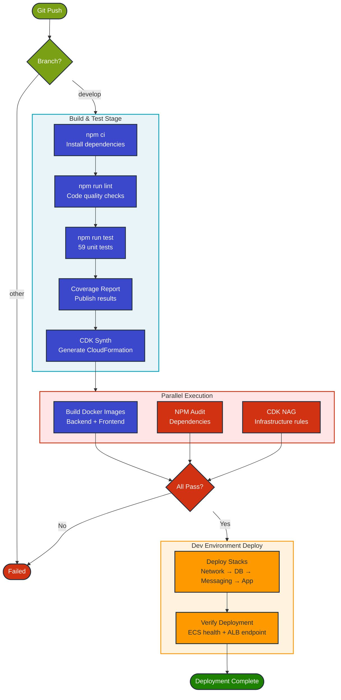

# CI/CD Strategy

## Table of Contents
- [Overview](#overview)
- [GitHub Actions Pipeline](#github-actions-pipeline)
  - [Workflow Architecture](#workflow-architecture)
  - [Pipeline Jobs](#pipeline-jobs)
  - [Configuration](#configuration)
  - [Best Practices](#best-practices)
- [Azure DevOps Alternative](#azure-devops-alternative)
  - [Pipeline Architecture](#pipeline-architecture-1)
  - [Configuration Requirements](#configuration-requirements)
- [Development Workflow](#development-workflow)
  - [Branch Strategy](#branch-strategy)
  - [Database Migrations](#database-migrations)
  - [Secret Management](#secret-management)
- [Operational Practices](#operational-practices)
  - [Rollback Strategy](#rollback-strategy)
  - [Testing Strategy](#testing-strategy)
  - [Monitoring](#monitoring)
  - [Cost Optimization](#cost-optimization)
- [References](#references)

## Overview

The Order Processing Infrastructure uses **GitHub Actions** for automated CI/CD. The pipeline builds, tests, and deploys infrastructure changes to AWS automatically when code is pushed to the develop branch.

**Why GitHub Actions?** It provides immediate access without parallelism approval delays, built-in secrets management, and seamless GitHub integration. For teams preferring Azure DevOps, a compatible pipeline configuration is also available.

## GitHub Actions Pipeline

### Workflow Architecture

The pipeline implements a four-job workflow that runs on every push to the develop branch:

```
┌─────────────────────┐
│  Build & Test       │  - Install dependencies
│                     │  - Lint TypeScript code
│                     │  - Run 59 unit tests
│                     │  - CDK synth
│                     │  - Publish artifacts
└──────────┬──────────┘
           │
           ├──────────────────────┬─────────────────────┐
           │                      │                     │
           ▼                      ▼                     ▼
┌──────────────────┐  ┌──────────────────┐  ┌──────────────────┐
│ Build Docker     │  │ Security Scan    │  │ Deploy to Dev    │
│ Images           │  │                  │  │                  │
│ - Backend        │  │ - NPM Audit      │  │ - NetworkStack   │
│ - Frontend       │  │ - CDK NAG        │  │ - DatabaseStack  │
└──────────┬───────┘  └────────┬─────────┘  │ - MessagingStack │
           │                   │             │ - AppStack       │
           └───────────┬───────┘             │ - Verify Health  │
                       │                     │                  │
                       └─────────────────────┘                  │
                                             └──────────────────┘
```

The entire pipeline completes in approximately 13 minutes from commit to deployed infrastructure.

### Pipeline Flow Diagram



### Pipeline Jobs

**1. build-and-test** (Always runs)

This foundational job validates code quality and functionality. It installs Node.js dependencies, runs TypeScript linting, executes 59 unit tests with coverage reporting, and synthesizes CloudFormation templates via CDK. The generated templates are uploaded as artifacts for the deployment stage.

**2. build-docker** (Parallel execution)

Builds production-ready Docker images for both backend and frontend services. Images are built for linux/amd64 platform with layer caching enabled to reduce build times by ~30%.

**3. security-scan** (Parallel execution)

Performs vulnerability scanning using npm audit and CDK NAG security checks. This job runs in informational mode (doesn't block deployment) to provide early warnings about potential security issues.

**4. deploy-dev** (Runs only on develop branch)

Downloads CDK artifacts and deploys all infrastructure stacks to the development environment. Stacks are deployed sequentially (Network → Database → Messaging → Application) to respect dependencies. After deployment, the job verifies ECS service health and ALB endpoint availability.

### Configuration

**Trigger:** Pushes to `develop` branch (excludes README.md, docs/**, .gitignore)

**Required GitHub Secrets:**
- `AWS_ACCESS_KEY_ID` - IAM user access key for CDK deployments
- `AWS_SECRET_ACCESS_KEY` - IAM user secret key for CDK deployments

**GitHub Environment:**
- `development` - Auto-deploys on develop branch commits

### Best Practices

**Secrets Management:** AWS credentials are stored as encrypted GitHub Secrets, never exposed in logs, and scoped to the repository only.

**Caching Strategy:** NPM packages and Docker layers are cached using GitHub Actions cache, reducing build time by approximately 30%.

**Parallel Execution:** Docker builds and security scans run concurrently to maximize pipeline efficiency.

**Artifact Retention:** CDK CloudFormation templates are retained for 7 days for auditing and debugging purposes.

## Azure DevOps Alternative

### Pipeline Architecture

For organizations using Azure DevOps, a complete pipeline configuration (`azure-pipelines.yml`) is available. The pipeline follows a three-stage approach:

```
┌─────────────────┐
│  Build Stage    │  - Install dependencies
│                 │  - Run linting & tests
│                 │  - CDK synth
│                 │  - Build Docker images
└────────┬────────┘
         │
         ▼
┌─────────────────┐
│  Dev Deploy     │  - Auto-deploy on 'develop' branch
│                 │  - Push images to ECR
│                 │  - CDK deploy to dev environment
└────────┬────────┘
         │
         ▼
┌─────────────────┐
│  Prod Deploy    │  - Manual approval required
│                 │  - Deploy on 'main' branch only
│                 │  - 4-eyes principle
│                 │  - Deploy to production
└─────────────────┘
```

**Note:** Azure DevOps free tier requires parallelism grant approval, which can take 2-3 business days. Setup instructions are in [docs/azure-devops-setup-guide.md](./azure-devops-setup-guide.md).

### Configuration Requirements

**Service Connections:**
- `aws-dev-service-connection` - AWS access for development environment
- `aws-prod-service-connection` - AWS access for production environment

**Variable Groups:**
- `aws-credentials` - Contains AWS_ACCOUNT_ID and AWS_REGION for development
- `aws-credentials-prod` - Contains production account credentials

**Environments:**
- `development` - Auto-deploy, no approvals required
- `production` - Requires 2 approvers, business hours gate, deployment window limits

## Development Workflow

### Branch Strategy

The project follows a simplified Git Flow model:

```
main (production-ready)
  │
  └── develop (active development)
        │
        ├── feature/add-monitoring
        ├── feature/improve-scaling
        └── bugfix/fix-queue-processing
```

**develop branch:** Auto-deploys to dev environment on every push. Requires 1 reviewer for pull requests.

**main branch:** Production-ready code. Currently not configured for auto-deployment as this is a demo environment.

### Database Migrations

**Current Implementation (Development):**

For the development environment, database schema is automatically managed on application startup using `CREATE TABLE IF NOT EXISTS` statements in `app/backend/src/database.ts:95-130`. When the backend container starts, it automatically:
- Creates the `orders` table if it doesn't exist
- Creates indexes for performance (created_at, customer_id)
- Uses idempotent SQL statements safe for multiple runs

This approach is suitable for development but not recommended for production as it doesn't provide version control or rollback capabilities.

**Production-Ready Approaches:**

Two recommended approaches for production database migrations:

1. **Lambda Function Approach:** Deploy a dedicated Lambda function with VPC access to Aurora. The function retrieves credentials from Secrets Manager, runs versioned migration scripts, and tracks applied versions in a `schema_migrations` table. The pipeline invokes the Lambda after infrastructure deployment.

2. **ECS Migration Task:** Run migrations as an ECS Fargate task before application deployment using `aws ecs run-task`. This approach uses the same container image but overrides the command to run migration scripts. See `docs/azure-devops-setup-guide.md` for detailed implementation with example migration runner code.

**Best Practices:** Manual review of migration scripts, dry-run in staging, database backups before production migrations, version tracking, transactional migrations, and documented rollback procedures.

### Secret Management

**Database Credentials:** Auto-generated by Aurora during cluster creation and stored in AWS Secrets Manager. The secret ARN is exported as a stack output.

**Application Secrets:** Created manually in Secrets Manager and referenced in CDK code.

**Pipeline Credentials:**
- GitHub Actions: Stored as encrypted GitHub Secrets
- Azure DevOps: Stored in Service Connections and Variable Groups

**Runtime Access:** Applications retrieve secrets using IAM task roles:

```typescript
const client = new SecretsManagerClient({ region: 'us-east-1' });
const response = await client.send(
  new GetSecretValueCommand({ SecretId: process.env.DB_SECRET_ARN })
);
const secret = JSON.parse(response.SecretString!);
```

## Operational Practices

### Rollback Strategy

**Infrastructure Rollback:** CDK uses CloudFormation, which automatically rolls back on deployment failure. Manual rollback to a previous version:

```bash
aws cloudformation update-stack \
  --stack-name dev-ApplicationStack \
  --use-previous-template
```

**Application Rollback:** Update ECS service to use previous Docker image tag:

```bash
aws ecs update-service \
  --cluster order-processing-cluster \
  --service order-processor-backend \
  --task-definition backend-task-def:42  # Previous revision
```

### Testing Strategy

**Build Stage:**
- TypeScript linting via ESLint
- 59 unit tests with Jest
- CloudFormation template snapshot validation
- npm audit security scanning

**Deployment Stage:**
- Endpoint verification via deployment scripts
- ALB target group health checks
- Basic smoke tests for critical paths

**Post-Deployment:**
- Integration tests covering end-to-end order processing
- Load testing with Artillery.io or Locust
- Security scans using OWASP ZAP or AWS Inspector

### Monitoring

**Pipeline Metrics:**
- Build success rate and deployment frequency
- Mean time to recovery (MTTR)
- Change failure rate (DORA metrics)

**Notifications:**
- Slack/Teams integration for pipeline status
- Email alerts for failed deployments
- SNS topics for AWS infrastructure alerts

### Cost Optimization

**Development Environment:**
- Single NAT Gateway: $32/month
- Aurora Serverless v2: 0.5-1 ACU ($0.12-0.24/hour)
- Single instance (no reader)
- Stop ECS tasks when not actively testing

**Production Environment:**
- 3 NAT Gateways for HA: $96/month
- Aurora Serverless v2: 0.5-4 ACU auto-scaling
- 1 writer + 1 reader instance for high availability
- Reserved capacity for predictable workloads
- S3 lifecycle policies for log retention

## References

- [AWS CDK Best Practices](https://docs.aws.amazon.com/cdk/v2/guide/best-practices.html)
- [GitHub Actions Documentation](https://docs.github.com/en/actions)
- [Azure DevOps Pipelines Documentation](https://docs.microsoft.com/en-us/azure/devops/pipelines/)
- [DORA Metrics](https://www.devops-research.com/research.html)
