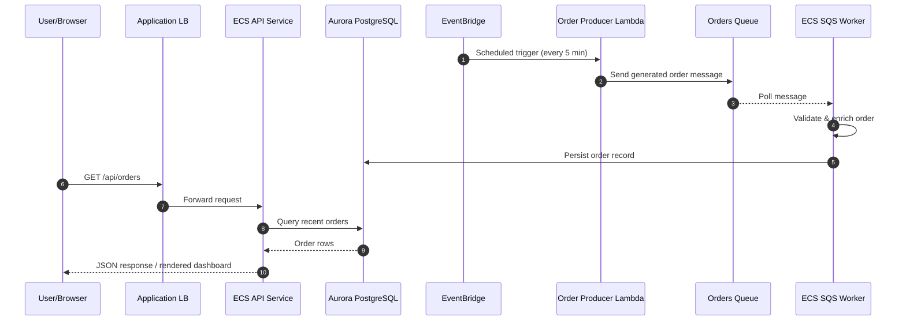

# Architecture & Flow Diagrams

The diagrams below capture the infrastructure, application flow, and CI/CD path for the order processing platform.

## 1) High-Level Infrastructure (AWS Official Icons)


Generated with AWS official icons (diagrams + Graphviz) to ensure reliable rendering.

## 2) Application Logical Flow (Order Lifecycle)



## 3) CI/CD Flow (Azure DevOps)

```mermaid
flowchart TB
    Dev([Developer commit/PR]) --> Build[Build: lint, unit tests, coverage, CDK synth, docker build]
    Build --> Artifacts[Publish artifacts (cdk.out, test results)]

    Build --> DevCheck{Branch == develop?}
    DevCheck -->|Yes| DeployDev[Deploy to dev (ECR push + CDK deploy)]
    DevCheck -->|No| SkipDev[Skip dev deploy]

    Build --> ProdCheck{Branch == main?}
    ProdCheck -->|Yes| Approval[[Manual approval]]
    ProdCheck -->|No| SkipProd[Skip prod deploy]
    Approval --> DeployProd[Deploy to prod (ECR push + CDK deploy)]

    DeployDev --> Mon[(Monitor: CloudWatch/SNS alerts)]
    DeployProd --> Mon
```
